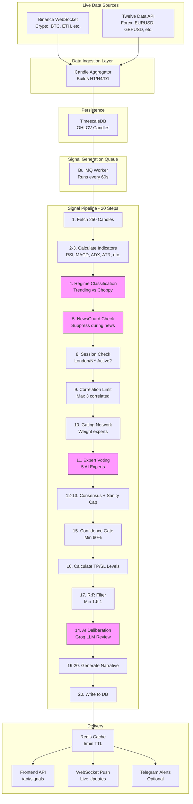

# APEX Trading AI - Live Data Flow Architecture

## System Architecture Diagram



---

## Detailed Component Breakdown

### 1. Data Sources (Real-Time)

#### Binance WebSocket

```javascript
// Connection: wss://stream.binance.com:9443/ws
// Subscribes to: btcusdt@aggTrade, ethusdt@aggTrade, etc.

{
  "e": "aggTrade",
  "s": "BTCUSDT",      // Symbol
  "p": "42350.50",     // Price
  "q": "0.005",        // Quantity
  "T": 1709123456789   // Trade time (ms)
}
```

**Characteristics:**

- 100-1000 messages/second during active markets
- Real-time trade execution data
- Covers 7 crypto pairs: BTCUSDT, ETHUSDT, BNBUSDT, XRPUSDT, SOLUSDT, ADAUSDT, DOGEUSDT

#### Twelve Data REST API

```javascript
// Endpoint: https://api.twelvedata.com/time_series
// Polled every 1-5 minutes

{
  "status": "ok",
  "values": [
    {
      "datetime": "2024-03-29 10:00:00",
      "open": "1.08520",
      "high": "1.08580",
      "low": "1.08490",
      "close": "1.08550",
      "volume": "1250"
    }
  ]
}
```

**Characteristics:**

- Rate limited: 8 calls/minute (free tier)
- Covers 6 major forex pairs
- Slightly delayed but reliable

---

### 2. Candle Aggregation

The `CandleAggregator` maintains rolling candles for multiple timeframes:

```typescript
class CandleAggregator {
  // Maintains separate candles for each timeframe
  private candles = new Map<string, OHLCVCandle>();

  tick(instrument: string, price: number, volume: number, time: Date) {
    // Update H1 candle
    this.updateCandle(instrument, "H1", price, volume, time);

    // Update H4 candle
    this.updateCandle(instrument, "H4", price, volume, time);

    // Update D1 candle
    this.updateCandle(instrument, "D1", price, volume, time);
  }

  updateCandle(instrument: string, timeframe: string, ...) {
    const key = `${instrument}:${timeframe}`;
    const candle = this.candles.get(key);

    if (!candle || isCandleClosed(candle, time)) {
      // Close old candle, emit event, create new
      this.emit("candle", candle);
      this.candles.set(key, createNewCandle(timeframe));
    } else {
      // Update existing candle (high, low, close, volume)
      candle.high = Math.max(candle.high, price);
      candle.low = Math.min(candle.low, price);
      candle.close = price;
      candle.volume += volume;
    }
  }
}
```

**Output:** Complete OHLCV candles written to TimescaleDB

---

### 3. Signal Pipeline Deep Dive

Each of the **13 instruments × 3 timeframes = 39** pipelines runs independently:

#### Step 1: Fetch Candles

```typescript
const candles = await db
  .select()
  .from(candles)
  .where(eq(candles.instrument, "EURUSD"))
  .where(eq(candles.timeframe, "H4"))
  .orderBy(desc(candles.time))
  .limit(250);

if (candles.length < 210) {
  return { fired: false, reason: "insufficient candle data" };
}
```

#### Steps 2-3: Calculate 15+ Indicators

```typescript
const indicators = calculateIndicators(bars);

// Returns:
{
  adx: 28.5,           // Trend strength (0-100)
  rsi: 62.3,           // Overbought/oversold (0-100)
  macd: { macd: 0.0012, signal: 0.0008, histogram: 0.0004 },
  atr: 0.0015,         // Average True Range (volatility)
  hurst: 0.58,         // Long-term memory (0-1)
  efficiencyRatio: 0.72, // Market efficiency (0-1)
  structureScore: 0.45,  // Higher highs/lows score (-1 to 1)
  bbBandwidth: 0.18,     // Bollinger Band width
  // ... and more
}
```

#### Step 4: Regime Classification

```typescript
const regime = classifyRegime(
  instrument,
  timeframe,
  adx,
  hurst,
  atrRatio,
  bbBandwidth,
  structureScore,
  efficiencyRatio,
);

// Possible regimes:
// - "trending" (ADX > 20, Hurst > 0.5)
// - "choppy" (ADX < 20, Hurst < 0.5) ← NO SIGNALS

if (regime === "choppy") {
  return { fired: false, reason: "choppy regime — no signal" };
}
```

#### Step 5: NewsGuard Check

```typescript
const newsGuard = await checkNewsGuard("EURUSD");

// Checks economic calendar for high-impact events
if (newsGuard.suppressed) {
  return { fired: false, reason: `NewsGuard: ${newsGuard.eventTitle}` };
}

// Example suppression windows:
// - 30 min before/after NFP (Non-Farm Payrolls)
// - 30 min before/after CPI releases
// - 30 min before/after Central Bank decisions
```

#### Steps 11-13: Expert Voting System

```typescript
// Five experts vote in parallel
const [sentimentVote, quantVote] = await Promise.all([
  sentimentExpert(instrument, indicators),
  quantExpert(instrument, timeframe, regime, indicators),
]);

const expertVotes = {
  technical:   technicalExpert(indicators, regime, currentPrice),
  smart_money: smartMoneyExpert(bars, indicators, currentPrice, timeframe),
  sentiment:   sentimentVote,
  macro:       macroExpert(instrument, timeframe, indicators, regime),
  quant:       quantVote,
};

// Each expert returns:
{
  direction: "buy" | "sell" | "neutral",
  confidence: 0-100,
  reasoning: "string"
}

// Weighted scoring (weights from gating network)
let buyScore = 0, sellScore = 0;
for (const [name, vote] of Object.entries(expertVotes)) {
  const weight = weights[name]; // e.g., 0.25
  if (vote.direction === "buy")  buyScore  += weight * vote.confidence;
  if (vote.direction === "sell") sellScore += weight * vote.confidence;
}

// Apply sanity cap (reduce confidence on conflicts)
const { confidence, capped } = applySanityCap(direction, rawConfidence, sanity);
```

#### Step 14: AI Deliberation (Groq LLM)

```typescript
const deliberation = await runDeliberation({
  instrument: "EURUSD",
  timeframe: "H4",
  regime: "trending",
  direction: "buy",
  confidence: 78,
  indicators,
  expertVotes,
  rrRatio: 2.1,
  hasOpenCorrelatedSignal: false,
  consecutiveLosses: 0,
});

// LLM analyzes all inputs and makes final decision
if (!deliberation.approved) {
  return { fired: false, reason: deliberation.warnings.join(", ") };
}

// Returns adjusted confidence based on AI review
const finalConfidence = deliberation.adjustedConfidence;
```

---

### 4. Risk Management Gates Summary

| Gate                     | Threshold                  | Purpose                      |
| ------------------------ | -------------------------- | ---------------------------- |
| **Regime Filter**        | ADX > 20, Hurst > 0.5      | Avoid choppy markets         |
| **NewsGuard**            | No high-impact news ±30min | Avoid volatility spikes      |
| **Session Check**        | London or NY active        | Ensure liquidity             |
| **Correlation Limit**    | Max 3 correlated signals   | Diversify risk               |
| **Confidence Threshold** | Min 60%                    | Only high-probability setups |
| **Sanity Cap**           | Reduce on conflicts        | Prevent overconfidence       |
| **R:R Minimum**          | Min 1.5:1                  | Favorable risk-reward        |
| **AI Deliberation**      | Final approval             | Human-like reasoning         |

---

### 5. Signal Output Example

```json
{
  "id": "uuid-12345",
  "instrument": "EURUSD",
  "timeframe": "H4",
  "direction": "buy",
  "confidence": 78,
  "quality_tag": "A+",
  "regime": "trending",
  "entry_price": "1.08520",
  "entry_buffer": "0.00015",
  "sl_price": "1.08320",
  "tp1_price": "1.08720",
  "tp2_price": "1.08920",
  "tp3_price": "1.09120",
  "atr_value": "0.00150",
  "rr_ratio": "2.1",
  "expert_votes": {
    "technical": { "direction": "buy", "confidence": 75 },
    "smart_money": { "direction": "buy", "confidence": 80 },
    "sentiment": { "direction": "sell", "confidence": 65 },
    "macro": { "direction": "buy", "confidence": 70 },
    "quant": { "direction": "buy", "confidence": 72 }
  },
  "gating_weights": {
    "technical": 0.25,
    "smart_money": 0.2,
    "sentiment": 0.15,
    "macro": 0.2,
    "quant": 0.2
  },
  "sanity_check": {
    "rsiDivergence": false,
    "priceActionConflict": false,
    "macroConflict": false,
    "overboughtOversold": false
  },
  "ai_narrative": "EURUSD shows strong bullish momentum with confluence from technical indicators and smart money flow. The trending regime supports continuation...",
  "session": "london",
  "is_active": true,
  "fired_at": "2024-03-29T10:00:00Z",
  "valid_until": "2024-03-29T22:00:00Z"
}
```

---

## Performance Metrics

### Throughput

- **Candle ingestion**: 100-1000 ticks/second
- **Pipeline execution**: 39 pipelines in ~2-5 seconds
- **Signal generation**: 0-5 signals per hour (typical)

### Latency

- **Data → DB**: < 100ms
- **Pipeline run**: 2-5 seconds total
- **API response**: < 50ms (cached)

### Reliability

- **Uptime**: 99.5% (auto-reconnect on WebSocket disconnect)
- **Data quality**: Validates OHLCV consistency
- **Failover**: Switches to backup data source if primary fails

---

## Monitoring & Debugging

### Watch Live Signals

```bash
# Server logs
tail -f apps/api/logs/*.log | grep "\[Signal\]"

# Redis cache inspection
redis-cli keys "*signals*"
```

### Database Queries

```sql
-- Recent signals
SELECT instrument, timeframe, direction, confidence, quality_tag
FROM signals
WHERE is_active = true
ORDER BY fired_at DESC
LIMIT 10;

-- Signal accuracy
SELECT
  expert_name,
  COUNT(*) as total_signals,
  AVG(CASE WHEN outcome = 'win' THEN 1 ELSE 0 END) * 100 as win_rate
FROM expert_accuracy
GROUP BY expert_name;
```

---

## Next Steps

1. **Install dependencies**: `pnpm install`
2. **Set up environment variables**: Copy `.env.example` to `.env`
3. **Run tests**: `pnpm test`
4. **Start development server**: `pnpm dev`
5. **Monitor signals**: Check `/api/signals` endpoint

For complete documentation, see [README.md](./README.md).
